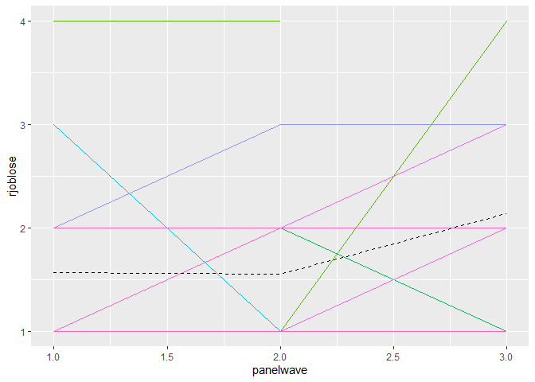

Lab 3
================
David DeStephano
May 2, 2020

``` r
pd = read.csv("C:\\Users\\daved\\Documents\\Advanced analytic techniques\\Lab 3\\MLM_joblose\\panel-for-R-1.csv")

library(plyr)
library(psych)
library(multcomp)
library(rms)
library(lme4)
library(plm)
```

Data
====

``` r
pd$rjoblose = 5- pd$joblose

vars = c("rjoblose", "degree", "age", "realinc", "panelwave", "idnum")
sub = pd[,vars]
```

The multilevel models will include "degree", "age", "realinc", and "panelwave" as independent variables/predictors of job loss.

Visualize curves
================

``` r
# Overall trend in job lose concern
library(ggplot2)
g_trend <- ggplot(sub, aes(x = panelwave, y = rjoblose))
(g_trend <- g_trend + stat_summary(fun.y=mean, geom="line", lwd = 1.25))
```

    ## Warning: Removed 4150 rows containing non-finite values (stat_summary).


``` r
# Empirical growth curves for idnum < 200 (& overall)
g_growth <- ggplot(subset(sub, idnum<200), 
                   aes(x = panelwave, y = rjoblose, group = idnum, color = factor(idnum)))
no_legend <- theme(legend.position="none")

g_id <- g_growth + geom_line() + no_legend 
g_id + stat_summary(fun.y=mean, geom="line", aes(group=1), lty = 2, color="black") 
```

    ## Warning: Removed 194 rows containing non-finite values (stat_summary).

    ## Warning: Removed 193 rows containing missing values (geom_path).



``` r
# individual regression lines for idnum < 200 (& overall)
g_reg <- g_growth + stat_smooth(method = lm, se = F) + no_legend
g_reg + stat_summary(fun.y=mean, geom="smooth", aes(group=1), lty = 2, color = "black")
```

    ## Warning: Removed 194 rows containing non-finite values (stat_smooth).

    ## Warning: Removed 194 rows containing non-finite values (stat_summary).


Simple linear model
===================

``` r
summary(lm(rjoblose ~ factor(degree) + age + realinc + panelwave, sub))
```

    ## 
    ## Call:
    ## lm(formula = rjoblose ~ factor(degree) + age + realinc + panelwave, 
    ##     data = sub)
    ## 
    ## Residuals:
    ##     Min      1Q  Median      3Q     Max 
    ## -1.0068 -0.5981 -0.3899  0.4172  2.8863 
    ## 
    ## Coefficients:
    ##                   Estimate Std. Error t value Pr(>|t|)    
    ## (Intercept)      1.792e+00  1.004e-01  17.857  < 2e-16 ***
    ## factor(degree)1 -1.573e-01  7.424e-02  -2.118  0.03430 *  
    ## factor(degree)2 -2.985e-01  9.297e-02  -3.211  0.00135 ** 
    ## factor(degree)3 -1.936e-01  8.302e-02  -2.332  0.01983 *  
    ## factor(degree)4 -2.808e-01  9.492e-02  -2.958  0.00314 ** 
    ## age             -2.519e-03  1.570e-03  -1.604  0.10885    
    ## realinc         -2.492e-06  6.340e-07  -3.931 8.81e-05 ***
    ## panelwave        9.627e-02  2.421e-02   3.976 7.30e-05 ***
    ## ---
    ## Signif. codes:  0 '***' 0.001 '**' 0.01 '*' 0.05 '.' 0.1 ' ' 1
    ## 
    ## Residual standard error: 0.7949 on 1667 degrees of freedom
    ##   (4325 observations deleted due to missingness)
    ## Multiple R-squared:  0.03686,    Adjusted R-squared:  0.03282 
    ## F-statistic: 9.115 on 7 and 1667 DF,  p-value: 4.336e-11

Naive OLS
=========

``` r
 lm.naive <- plm(rjoblose ~ factor(degree) + age + realinc + panelwave,
                 data = sub, index = "idnum", model = "pooling")


clusterSE <- function(fit, cluster.var, data){ # note: cluster.var should be entered as character string
  require(plm); require(lmtest)
  
  if (missing(data) & cluster.var %in% colnames(index(fit))){
    cvar <- index(fit, cluster.var)
    n <- length(unique(cvar))
    N <- length(cvar)
  }
  else{
    row.ids <- as.numeric(rownames(model.frame(fit)))
    # 1. get number of clusters (omitting individuals with missingness on "divorce.easier" and/or "divorced")
    n <- length(unique(data[row.ids, cluster.var]))
    # 2. get number of observations (again omitting the same individuals with missingness)
    N <- length(row.ids) 
  }
  
  #3. compute degrees of freedom
  df <- (n/(n - 1)) * (N - 1)/fit$df.residual
  # compute variance-covariance matrix
  vcov <- df*vcovHC(fit, type = "HC0", cluster = "group")
  # retest coefficients  
  coeftest(fit, vcov = vcov)
}


clusterSE(fit = lm.naive, cluster.var = "idnum")
```

    ## 
    ## t test of coefficients:
    ## 
    ##                    Estimate  Std. Error t value  Pr(>|t|)    
    ## (Intercept)      1.7919e+00  1.1870e-01 15.0961 < 2.2e-16 ***
    ## factor(degree)1 -1.5726e-01  8.8411e-02 -1.7788  0.075455 .  
    ## factor(degree)2 -2.9854e-01  9.9636e-02 -2.9963  0.002773 ** 
    ## factor(degree)3 -1.9359e-01  9.7800e-02 -1.9794  0.047930 *  
    ## factor(degree)4 -2.8078e-01  1.0096e-01 -2.7812  0.005477 ** 
    ## age             -2.5192e-03  1.8502e-03 -1.3615  0.173525    
    ## realinc         -2.4921e-06  6.2382e-07 -3.9948 6.756e-05 ***
    ## panelwave        9.6265e-02  2.2234e-02  4.3296 1.583e-05 ***
    ## ---
    ## Signif. codes:  0 '***' 0.001 '**' 0.01 '*' 0.05 '.' 0.1 ' ' 1

Net of other factors, for each wave there is 9% less job loss.

"Empty" Random intercept model
==============================

``` r
 nullmodel <- lmer(rjoblose ~ (1 | idnum), 
                   data = sub, REML = FALSE)

summary(nullmodel) 
```

    ## Linear mixed model fit by maximum likelihood  ['lmerMod']
    ## Formula: rjoblose ~ (1 | idnum)
    ##    Data: sub
    ## 
    ##      AIC      BIC   logLik deviance df.resid 
    ##   4379.1   4395.7  -2186.6   4373.1     1847 
    ## 
    ## Scaled residuals: 
    ##     Min      1Q  Median      3Q     Max 
    ## -2.0141 -0.5999 -0.3768  0.4332  3.2071 
    ## 
    ## Random effects:
    ##  Groups   Name        Variance Std.Dev.
    ##  idnum    (Intercept) 0.1953   0.4419  
    ##  Residual             0.4643   0.6814  
    ## Number of obs: 1850, groups:  idnum, 898
    ## 
    ## Fixed effects:
    ##             Estimate Std. Error t value
    ## (Intercept)  1.58071    0.02218   71.26

``` r
rho <- function(fit){
 varcor <- VarCorr(fit) # extract the variance components using VarCorr()
 varcor <- as.data.frame(varcor)[, "sdcor"] # get just the std devs we want
 sigma_u <- varcor[1] # get sigma_u
 sigma_e <- varcor[2] # get sigma_e
 rho <- sigma_u^2 / (sigma_u^2 + sigma_e^2) # compute rho (fraction of variance due to u_i)
+ rho
}

rho(nullmodel)
```

    ## [1] 0.2960388

Rho means that 29.6 percent of the variance in rjoblose is between different individuals.

random intercept model
======================

``` r
 lmer.joblose1 <- lmer(rjoblose ~ factor(degree) + age + realinc + panelwave + (1 | idnum), 
                   data = sub, REML = FALSE)
```

    ## Warning: Some predictor variables are on very different scales: consider
    ## rescaling

``` r
summary(lmer.joblose1)
```

    ## Linear mixed model fit by maximum likelihood  ['lmerMod']
    ## Formula: rjoblose ~ factor(degree) + age + realinc + panelwave + (1 |  
    ##     idnum)
    ##    Data: sub
    ## 
    ##      AIC      BIC   logLik deviance df.resid 
    ##   3918.4   3972.6  -1949.2   3898.4     1665 
    ## 
    ## Scaled residuals: 
    ##     Min      1Q  Median      3Q     Max 
    ## -2.1562 -0.5852 -0.3054  0.4513  3.4135 
    ## 
    ## Random effects:
    ##  Groups   Name        Variance Std.Dev.
    ##  idnum    (Intercept) 0.1767   0.4203  
    ##  Residual             0.4543   0.6740  
    ## Number of obs: 1675, groups:  idnum, 836
    ## 
    ## Fixed effects:
    ##                   Estimate Std. Error t value
    ## (Intercept)      1.798e+00  1.072e-01  16.777
    ## factor(degree)1 -1.617e-01  8.052e-02  -2.008
    ## factor(degree)2 -2.869e-01  9.983e-02  -2.874
    ## factor(degree)3 -2.139e-01  9.074e-02  -2.358
    ## factor(degree)4 -2.905e-01  1.043e-01  -2.786
    ## age             -2.482e-03  1.788e-03  -1.388
    ## realinc         -2.411e-06  6.789e-07  -3.552
    ## panelwave        9.602e-02  2.168e-02   4.429
    ## 
    ## Correlation of Fixed Effects:
    ##             (Intr) fct()1 fct()2 fct()3 fct()4 age    realnc
    ## factr(dgr)1 -0.589                                          
    ## factr(dgr)2 -0.492  0.705                                   
    ## factr(dgr)3 -0.541  0.772  0.649                            
    ## factr(dgr)4 -0.404  0.683  0.574  0.669                     
    ## age         -0.636 -0.019  0.011  0.037 -0.045              
    ## realinc     -0.025 -0.103 -0.154 -0.258 -0.320 -0.133       
    ## panelwave   -0.248 -0.044 -0.023 -0.052 -0.050 -0.122  0.018
    ## fit warnings:
    ## Some predictor variables are on very different scales: consider rescaling

When accounting for individual variation in intercepts, panelwave is still significant and does not differ from our standard ols model. The paramter for panelwave was .0963 and is now .0960

``` r
rho(lmer.joblose1)
```

    ## [1] 0.2799886

Now rho implies 28% of variance of job jossis due to differences between individuals

random slopes
=============

``` r
lmer.joblose2 <- lmer(rjoblose ~factor(degree) + age + realinc + panelwave + (1 + panelwave | idnum), data = sub, REML = F)
```

    ## Warning: Some predictor variables are on very different scales: consider
    ## rescaling

    ## Warning in checkConv(attr(opt, "derivs"), opt$par, ctrl =
    ## control$checkConv, : Model failed to converge with max|grad| = 0.00268608
    ## (tol = 0.002, component 1)

``` r
summary(lmer.joblose2)
```

    ## Linear mixed model fit by maximum likelihood  ['lmerMod']
    ## Formula: rjoblose ~ factor(degree) + age + realinc + panelwave + (1 +  
    ##     panelwave | idnum)
    ##    Data: sub
    ## 
    ##      AIC      BIC   logLik deviance df.resid 
    ##   3920.3   3985.4  -1948.2   3896.3     1663 
    ## 
    ## Scaled residuals: 
    ##     Min      1Q  Median      3Q     Max 
    ## -2.0477 -0.5615 -0.3093  0.4567  3.3559 
    ## 
    ## Random effects:
    ##  Groups   Name        Variance Std.Dev. Corr 
    ##  idnum    (Intercept) 0.23614  0.4859        
    ##           panelwave   0.02576  0.1605   -0.48
    ##  Residual             0.42983  0.6556        
    ## Number of obs: 1675, groups:  idnum, 836
    ## 
    ## Fixed effects:
    ##                   Estimate Std. Error t value
    ## (Intercept)      1.794e+00  1.072e-01  16.734
    ## factor(degree)1 -1.585e-01  8.038e-02  -1.971
    ## factor(degree)2 -2.836e-01  9.965e-02  -2.846
    ## factor(degree)3 -2.141e-01  9.066e-02  -2.362
    ## factor(degree)4 -2.881e-01  1.042e-01  -2.765
    ## age             -2.528e-03  1.789e-03  -1.413
    ## realinc         -2.377e-06  6.779e-07  -3.507
    ## panelwave        9.762e-02  2.225e-02   4.387
    ## 
    ## Correlation of Fixed Effects:
    ##             (Intr) fct()1 fct()2 fct()3 fct()4 age    realnc
    ## factr(dgr)1 -0.589                                          
    ## factr(dgr)2 -0.491  0.704                                   
    ## factr(dgr)3 -0.539  0.770  0.648                            
    ## factr(dgr)4 -0.402  0.681  0.571  0.667                     
    ## age         -0.637 -0.018  0.011  0.036 -0.045              
    ## realinc     -0.024 -0.103 -0.152 -0.258 -0.318 -0.134       
    ## panelwave   -0.253 -0.041 -0.021 -0.049 -0.048 -0.119  0.016
    ## fit warnings:
    ## Some predictor variables are on very different scales: consider rescaling
    ## convergence code: 0
    ## Model failed to converge with max|grad| = 0.00268608 (tol = 0.002, component 1)

The coefficient for panelwave has still not changed.

The intercept is 1.79, but there is a standar deviation of 0.23614 around that mean

On average, for each subsequent panelwave, job loss is 9% lower, but there is a standard deviation of .025 around that average slope, which is not very high. We can test if modeling random slope was necessary in the next step.

are random slopes necessary?
----------------------------

``` r
anova(lmer.joblose1, lmer.joblose2)
```

    ## Data: sub
    ## Models:
    ## lmer.joblose1: rjoblose ~ factor(degree) + age + realinc + panelwave + (1 | 
    ## lmer.joblose1:     idnum)
    ## lmer.joblose2: rjoblose ~ factor(degree) + age + realinc + panelwave + (1 + 
    ## lmer.joblose2:     panelwave | idnum)
    ##               Df    AIC    BIC  logLik deviance  Chisq Chi Df Pr(>Chisq)
    ## lmer.joblose1 10 3918.4 3972.6 -1949.2   3898.4                         
    ## lmer.joblose2 12 3920.3 3985.4 -1948.2   3896.3 2.0727      2     0.3547

Random slope is not necessary in this case
